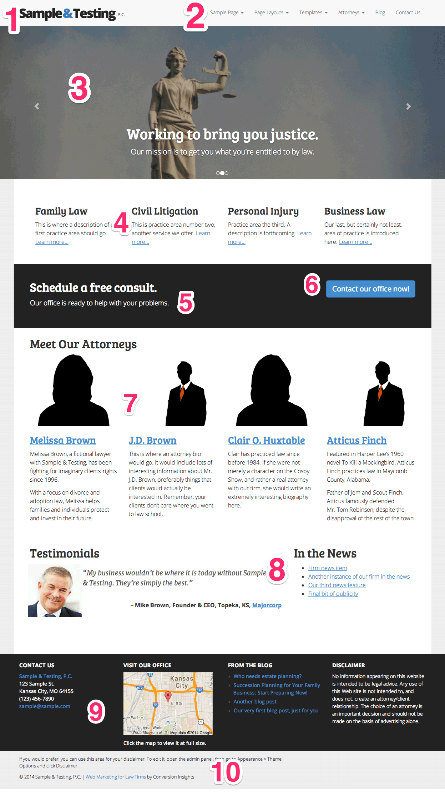
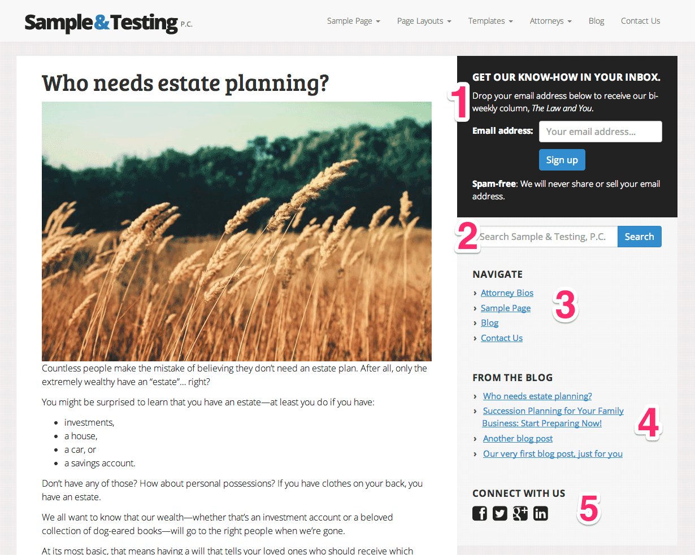

Documentation: The Modern Law Firm Theme
=============================================

- **Theme creator**: Tyler Young of [Conversion Insights][CI]
- **Email**: <tyler@conversioninsights.net>

Thanks for using my theme. If you have any questions that are beyond the scope of this help file, feel free to email me at <tyler@conversioninsights.net>.

If you need support, customization, or help with your firm's Web marketing, [email me](mailto:tyler@conversioninsights.net) and I'll do my best to help.

For help & advice on your online marketing campaigns, you can sign up for my [free course on getting more clients from your Web site](http://conversioninsights.net/get-clients-for-law-firm/?utm_source=themeDocumentation&utm_medium=web&utm_campaign=moreClients).

### Table of Contents
- [Getting Started](#gettingstarted)
    + [Installing and activating the theme](#installingandactivatingthetheme)
    + [Installing recommended plugins](#installingrecommendedplugins)
    + [Importing sample content](#importingsamplecontent)
    + [Setting up Google Analytics](#settingupgoogleanalytics)
- [Creating the Home Page (A Tour of the Theme)](#creatingthehomepageatourofthetheme)
    + [Image sliders](#imagesliders)
    + [Attorney profiles](#attorneyprofiles)
- [Notes on the Full-Width Layout](#notesonthefull-widthlayout)
- [Configuring the Menus and Navigation](#configuringthemenusandnavigation)
- [Setting Up the Sidebar](#settingupthesidebar)
- [Setting Up the Footer](#settingupthefooter)
- [Setting Up the Blog](#settinguptheblog)
- [Creating the Contact Page](#creatingthecontactpage)
- [Creating Landing Pages for Ad Campaigns](#creatinglandingpagesforadcampaigns)
- [Creating a Privacy Policy](#creatingaprivacypolicy)
- [Customizing the Theme](#customizingthetheme)
    + [Using the WordPress admin menu](#usingthewordpressadminmenu)
    + [Using HTML & CSS](#usinghtmlcss)
    + [Using Javascript](#usingjavascript)
- [Getting Help and Support](#gettinghelpandsupport)
- [Updates to the Theme](#updatestothetheme)

Getting Started
------------------------------------------------------

### Installing and activating the theme
To install the theme, do the following:

1. Log in to the WordPress admin menu, typically found at `yoursitehere.com/wp-admin/`
2. Click **Appearance** in the left-hand menu. This will load the theme selection page.
3. Near the top of the page, just to the right of the word "Themes", click the **Add new** button.
4. In the search box, type the name of this theme.
5. Click the **Install Now** link below the theme you want to install.
6. When the installation finishes, click the **Activate** link that appears.
7. Immediately upon activating, WordPress will prompt you to make a number of changes (create a static front page, change permalink structure, and so on). **If you are creating a *new* site**, it is recommended that you say "yes" to each of these, then press the **Save Changes** button. If you are changing the theme of an existing site, you may not want to do this.
8. Finally, after activating the theme, there will be a number of "recommended plugins" displayed at the top of the administration pages. See the following section for help installing those plugins.

### Installing recommended plugins
After activating the theme, you'll receive a message at the top of each Admin page informing you of a number of recommended and required plugins.

Note that the theme *will not function correctly* without the required plugins.

Click the **Begin installing plugins** link to install these plugins. After installing the plugins, the installer will offer to **Return to Required Plugins Installer**. There, you can also activate all the plugins.

### Importing sample content
**NOTE**: Before importing the sample content, it is important that you [install the recommended & required plugins](#installingrecommendedplugins). Failing to do so will cause some content *not* to be imported, making it more difficult for you to recreate the theme's demo.

With the plugins installed and activated, you can import the sample content by doing the following:

1. Log in to the WordPress admin menu, typically found at `yoursitehere.com/wp-admin/`
2. Hover your mouse over **Tools** in the left-hand menu, then click **Import**. Select the WordPress option.
3. You will be prompted to install the Wordpress Importer; simply click the **Install Now** button.
4. After the installation completes, click the **Activate Plugin & Run Importer** link.
5. Upload the "sample-content.xml" file included with this theme (found in the `docs` directory).
6. After the import is complete, visit the Pages section of the Admin menu to see the sample pages.

### Setting up Google Analytics
To set up Google Analytics tracking on all pages of the site, do the following:

1. Log in to the WordPress admin menu, typically found at `yoursitehere.com/wp-admin/`
2. Hover over Appearance in the left-hand menu, then click Theme Options.
3. Click the Basic tab near the top of the page.
4. In the text box labeled Google Analytics ID, type the ID that Analytics associates with this site. It will be in the format `UA-XXXXX-Y`.
    - For help finding your Google Analytics ID, see [Google's documentation on the topic](https://support.google.com/analytics/answer/1032385?hl=en)

Note that *only* accounts using "Universal Analytics" are supported. (Don't worry, though---it's easy to [upgrade a "Classic Analytics" account to the new Universal version](https://support.google.com/analytics/answer/3450662?hl=en).)

Creating the Home Page (A Tour of the Theme)
------------------------------------------------------

The home page in the demo consists of a number of different elements. Understanding how these elements are created will allow you to design your own home page (and, with little exception, the rest of your site as well).

1. Firm name/logo
    - By default, this is a plain-text version of your site title (defined on your Settings > General page.
    - Alternatively, you can use your own logo (an image file). Upload the image using the **Appearance (advanced)** tab of the Theme Options. Note that the recommended image size is 300&times;37px.
2. Navigation
    - Like most themes, we use the WordPress menu system for navigation menus.
    - You can set up your menus using the Appearance > Menus page.
    - By default, the theme create a Primary Navigation menu and assign it to the Primary Navigation theme location (that is, the location at the top-right of the page).
3. Image slider
    - The image slider has 2 parts: the individual slides (which can be managed just like posts or pages) and the on-page code which pulls together a collection of slides into a complete slider. See the section [Image sliders](#imagesliders) below for more information.
4. Text blocks
    - These are four standard blocks of texts, laid out using the Advanced Layout Creator  dialog in the Wordpress editor.
    - To insert a block of 4 columns like this, you would click the Advanced Layout Creator button , click on Quarters, and click the button for a four quarter split. Then, when the columns appear in the editor, you can type and format your text as usual.
5. Callout banner (colored band)
    - Like the text blocks above, this colored band is inserted using a button above the WordPress editor (in this case, the Insert Colored Band button ). Then, you can modify the contents of that band in the WordPress editor just like normal.
6. Call-to-action button
    - Like the text blocks and callout banner above, the call-to-action button is inserted using a button above the text editor for the page.
    - The Insert Call to Action Button  asks for 3 things: the text of the button, the URL that the button should take the user to when clicked, and the alignment of the button.
7. Attorney profiles
    - The attorney profile blocks are similar to the slider: attorney profiles (or bios) are created individually just like a normal post, and they can then be inserted onto a particular page. See the section [Attorney profiles](#attorneyprofiles) below for details.
8. Testimonials
    - The testimonials seen here come courtesy of one of our recommended plugins, [Testimonials by Aihrus](http://wordpress.org/plugins/testimonials-widget/). The plugin provides the shortcode `[testimonialswidget_widget random=true]` to display all known testimonials at random.
    - This shortcode simply placed inside a 3/4 | 1/4 split text block using the Advanced Layout Creator , like the text blocks above. To the right is simply normal WordPress content (a bulleted list of links to other pages).
9. Footer widgets
    - By default, the footer is divided into 4 columns. Content is added to the footer using the Appearance > Widgets page; simply drag and drop widgets from the left side of the screen to the **Footer** box on the right. Each widget you add will be treated as its own column.
    - In the Theme Options page, under the **Basics** tab, you can change the number of columns that the footer is divided into. Thus, if you only have 3 widgets (blocks of content), you can tell the theme to divide the footer into 3 instead of 4.
10. Bottom of page
    - The very bottom of the page has 2 blocks of content: an optional disclaimer, and attribution information. You can use the **Disclaimer** tab on the Theme Options page to set your own text here. (Obviously, the area is designed to house the text of your disclaimer, but you could optionally add other content, like a link to your Terms of Use instead.)

### Image sliders

As mentioned above, there are 2 steps to setting up an image slider:

1. Creating the slides themselves, and
2. Telling a particular page to show a particular set of slides.

To do 1), go to the Slides page of the WordPress Admin interface. There, you can add, delete, or modify slides. The title of the slide, along with the content of the slide's "page" will be displayed in the image slider on top of the slide's Featured Image. Thus, the Featured Image is the slide background, while the title and content are the slide content.

Note that the recommended size for slide images depends on whether you're using the slides at the very top of the page or within it. (Slides at the very top of the page can be stretched much wider than the typical page.)

- For slides used at the top of the page, the recommended size is 1920&times;657px.
- For slides used within a page, the recommended dimensions are 1170&times;400px.

(In reality, the height of the images can be whatever you want, so long as it is consistent.)

After slides are created, you must tell a particular page to use them. In this case, applying a Category to the slides you want to use can be very helpful---you'll be able to tell WordPress to use *only* the slides of that particular Category in your slider.

There are 2 ways to add a slider to a page:

1. Insert it within the page content, or
2. Insert it at the top of the page, above the rest of the content.

You can use the Insert Image Slider button  located above the page's content editor to add a slider anywhere on the page. You will be asked for the Category of the slides to use; leave this blank to show all slides, or type a category's *slug* to show only slides in that Category. (Note that the "slug" is like the URL: if you have a Category called "Attorney Stock Photos", the slug will typically be "attorney-stock-photos".)

Alternatively, you can add the image slider at the top of the page, below the navigation bar and above the page content. To do so, do the following:

1. Edit the page as usual in the WordPress Admin interface.
2. Scroll down to the very bottom of the editing page, to the box labeled "The Modern Law Firm theme options."
3. Check the box labeled "Show giant image slider at top of page."
4. If you would like, you can type a Category's slug in the text box just below that. Or, leave the box empty to show all slides.
5. Update or publish the page as usual.

### Attorney profiles

Attorney profiles in the theme are very similar to image sliders (see [the previous section](#imagesliders)). That is, you create the individual attorney profiles (using the Attorneys section of the Admin interface), then insert those attorney profiles onto a particular page using a button (in this case, the Insert Attorneys button ).

When inserting these attorney profiles, you'll be able to choose how many columns to display them in (one attorney per column), and how much of their profile to display---that is, the maximum number of characters to show from their profile.

There is one more place you can display the attorney profiles, though. You can use the "All Attorneys" template on a particular page. This is useful if you would like a page listing all attorneys, with links to the individual attorney's bios. Thus, in the demo site, we have created an "Attorneys" page that uses this template to list all the firm's attorneys.

Notes on the Full-Width Layout
------------------------------------------------------

This theme supports both a standard Web page layout and a full-width layout.

When using the standard page layout (a.k.a. the "boxed" layout), you have the opportunity to use a background pattern or image. (For an example of what that looks like, [see the demo site](http://cisandbox.wpengine.com/home-page-3/?layout=normal&bg=image).)

With the full-width view, however, some content (like image sliders and colored bands) will stretch to the very edges of the screen. Text content, however, will *not* stretch to the edges of the screen. (To do so would be undesirable---when text columns become too wide, they become very difficult to read.)

For the most part, the two layouts are interchangeable---you could switch between them without issue. In fact, when using a sidebar on a particular page, the full-width layout will look just like the "boxed" layout (it will just have a white background instead of a pattern/image/etc.)

With that said, you may experience some weirdness when using full-width text content on pages without a sidebar. (Lists, blockquotes, and the like may be slightly off in their formatting.)

To correct this, simply put your full-width text content into a custom, single-column layout, by doing the following:

1. Open the WordPress editor for the full-width (no-sidebar) page in question.
2. Click the "Make columns" button  in the bank of editor buttons.
3. Tell it to create a 1 column layout (type the number 1 and press enter).
4. Replace the content that appears with your own.

Configuring the Menus and Navigation
------------------------------------------------------

As discussed in the previous section, this theme uses [the WordPress menu system](http://codex.wordpress.org/Appearance_Menus_SubPanel) for its navigation menus.

To edit the navigation menu, open the Appearance > Menus page.

The navigation menu in the top right of the page is taken from the "Primary Navigation" theme location. Thus, to use a menu you have created in that position, you would simply:

1. Visit the Appearance > Menus page and edit the menu you wish to use.
2. Scroll down page to the section labeled "Menu Settings."
3. Check the box labeled "Primary Navigation" next to the "Theme Locations" label.

By default, when you activate the theme, it will create a Primary Navigation menu and assign it to the Primary Navigation theme location (that is, the location at the top-right of the page).

Setting up the Sidebar
------------------------------------------------------

The sidebar in the theme demo is made up of 5 components, each configured as "[Widgets](http://codex.wordpress.org/Appearance_Widgets_SubPanel)" on the Appearance > Widgets page. To add any of these widgets to the sidebar, simply drag them from the left side of the Widgets screen into the box labeled "Primary" (the primary sidebar).

1. Newsletter signup form
    - The newsletter signup widget comes courtesy of the recommended plugin, [Newsletter Sign-Up](http://wordpress.org/plugins/newsletter-sign-up/). This plugin works with email sending services like MailChimp, Constant Contact, AWeber, and so on. The theme applies a custom styling to this widget to give it the dark, attention-grabbing background.
2. Site search
    - This is the standard WordPress search widget.
3. Sidebar navigation
    - This navigation list is inserted using the standard WordPress "Custom Menu" widget. (You'll need to create the menu you want to display using the Appearance > Menus page.)
4. Latest blog posts
    - This is the standard WordPress "Recent Posts" widget.
5. Social media icons
    - These come courtesy of this theme's "Social Media Icons" widget. To use these icons, do the following:
        1. Drag the Social Media Icons widget to your sidebar.
        2. Visit the Appearance > Theme Options page. There, click the Social Media Links tab.
        3. Add the URLs of your firm's social media profiles there. (To hide an icon, simply leave the URL field blank.)
        4. Near the bottom of the menu, you can choose to either display the icons in full color or monochrome. (Note that when you hover over the monochrome icons, they gain their full color.) You can compare the two below: 
            

[sidebar]: #settingupthesidebar "Setting Up the Sidebar"

Setting up the Footer
------------------------------------------------------
The footer, much like [the sidebar, described above][sidebar], is made up of a number of widgets. You can add or remove widgets from the footer using the Appearance > Widgets page. Simply drag and drop widgets from the left side of the screen to the **Footer** box on the right. 

By default, the footer is divided into 4 columns. Each widget you add will be treated as its own column. However, if you are using more or fewer widgets, you can change the number of column divisions.

To do so, 

1. Open the Appearance > Theme Options page, and click the **Basics** tab.
2. There, under the **Footer Options** heading, you can change the number of columns that the footer is divided into. Thus, if you only have 3 widgets (blocks of content), you would use 3 columns instead of 4.

The footer is made up of the following elements:

1. Contact information
    - This is the "Roots: vCard" widget provided by this theme. You can use it to enter your address, phone number, and email.
2. Google Maps
    - This is the Google Maps Widget provided by the recommended plugin, [Google Maps Widget](http://wordpress.org/plugins/google-maps-widget/).
3. Blog posts
    - This is the standard WordPress "Recent Posts" widget (just like [in the sidebar][sidebar]).
4. Disclaimer text
    - This is a simple Text widget which comes standard with WordPress.
5. Alternate disclaimer text location
    - Instead of placing your disclaimer in the dark-colored (attention-grabbing) region of the footer, you can place it below. You can use the **Disclaimer** tab on the Theme Options page to set your own text here. (Obviously, the area is designed to house the text of your disclaimer, but you could optionally add other content, like a link to your Terms of Use instead.)
    - If you leave the Theme Options' Disclaimer field blank, this will be hidden.
6. Copyright and credits
    - This is standard text for the theme: a copyright for your firm, and a link attributing the theme design to Conversion Insights.

Setting Up the Blog
------------------------------------------------------

To create a blog page (a page listing all your blog posts), do the following:

1. Create a new Page using the Admin's Page editor.
2. In the "Page Attributes" box in the right-hand sidebar, find the Template field.
3. Select the Blog template.
4. Type any text you want to appear above the blog posts listings in the normal WordPress editor. Your most recent blog posts will appear beneath that.
5. By default, 5 blog posts will be displayed per page. (Users can click the "Previous posts" link near the bottom of the page to see more.) To change the number of posts per page:
    1. Visit the Theme Options page.
    2. Click the Basics tab.
    3. Change the "Number of blog posts to show per page" field.
    4. Click **Save Options*** in the lower right.

Creating the Contact Page
------------------------------------------------------

The contact page in the demo theme uses the standard page template, but it relies on the recommended plugin "[Contact Form 7](http://wordpress.org/plugins/contact-form-7/)" (or some other contact form plugin) to work. The Contact Form 7 plugin simply provides a shortcode for displaying a previously created contact form on the page.

Creating Landing Pages for Ad Campaigns
------------------------------------------------------

A landing page is a stripped-down version of your normal Web site designed for one goal: to get a visitor to fill out your contact form. They typically have much less visual clutter, and fewer options for visitors. Whereas your home page may have 20 or 30 links to various things a visitor could check out, your landing page should have maybe 2.

Landing pages are a great way to make the most of traffic you get from online advertisements. Since you have a good idea of *exactly* why the visitor is coming to you, you can tailor the landing page to that goal. (For more help with your online marketing campaigns, you can sign up for my [free course on getting more clients from your Web site](http://conversioninsights.net/get-clients-for-law-firm/?utm_source=themeDocumentation&utm_medium=web&utm_campaign=moreClients).)

(HubSpot has [a nice guide to the basics of landing pages](http://blog.hubspot.com/marketing/what-is-a-landing-page-ht).)

To create a landing page with this theme, do the following:

1. Create a new Page using the Admin's Page editor.
2. In the "Page Attributes" box in the right-hand sidebar, find the Template field.
3. Select the "Landing page" template.
4. Type your page content in the WordPress editor as usual.

Creating a Privacy Policy
------------------------------------------------------

The theme includes a boilerplate privacy policy, to the effect that your site uses analytics and may use advertising technologies present in Google AdSense. This is included largely to satisfy Google, who *claims* to require this policy to be posted on your site if you're using Google Analytics or Google AdSense. (The reality, of course, is that [no one actually does this](http://searchengineland.com/how-many-google-privacy-policies-are-you-violating-50182), but hey---we made it easy to add the Google-approved verbiage to your site.)

To insert this boilerplate, simply create a new, blank page, and insert the following shortcode:

`[privacy /]`

...That's it!

Customizing the Theme
------------------------------------------------------

### Using the WordPress Admin menu

By far the simplest way to customize the theme is to use the WordPress Admin interface.

You can use the Appearance > Customize page to change things like your color scheme, your site title, and your navigation. Changing the color scheme will change the color of links, the background "highlight" color, and so on.

For more advanced visual customization, go to the Appearance > Theme Options page and click on the "Appearance (advanced)" tab. There, you can:

- upload a logo (to go in the top left of the page next to the navigation),
- upload a large image to use as a full-screen background for your pages (rather than the stock flat color), or
- select a subtle pattern as your page backgrounds (rather than the stock flat color).

(Note that using a full-screen image will override any pattern settings.)

### Using HTML & CSS

If you'd like to get your hands dirty, you can edit the theme's HTML and CSS.

**IMPORTANT NOTE**: Simply editing the theme's HTML (PHP) and CSS is not a great idea, because any changes you make may be overwritten when you upgrade the theme to a newer version.

Instead, you should [create a Child Theme](http://codex.wordpress.org/Child_Themes) and modify *that* theme. This is the *only* way to ensure your modifications will remain when the theme is upgraded.

We've included a sample, very basic child theme in the `docs` directory for you to start with. See the `modern-law-child-theme` directory you find there for a very detailed guide to using your child theme.

When making modifications, here's what you need to know:

#### PHP & HTML
The theme's PHP is built atop [the Roots theme framework][Roots]. Roots theme are much, much more organized than a typical theme, and there is much less code repetition. While this is great in the long run, it means things don't always appear where you expect. 

For instance, instead of your a typical page template looking like this:

    <?php get_header(); ?>
      

        

          <?php // Our page specific markup and loop goes here ?>
        

        <?php get_sidebar(); ?>
      

    <?php get_footer(); ?>

...it now looks like this:

    <?php // Our page specific markup and loop goes here ?>

(All other markup is inherited from `base.php` and the like. More info in [the Roots documentation on the theme wrapper](http://roots.io/an-introduction-to-the-roots-theme-wrapper/).)

Notwithstanding these atypical aspects of the theme, [the Roots documentation](http://roots.io/docs/) should get you up to speed on the changes without much trouble.

#### CSS
The theme's CSS is built on [the Twitter Bootstrap CSS framework][Bootstrap]. That means it has built-in support for fully responsive designs, plus common (and extremely useful) components like [forms](http://getbootstrap.com/css/#forms), [buttons](http://getbootstrap.com/css/#buttons), [dropdowns](http://getbootstrap.com/components/#dropdowns), [navigation tabs](http://getbootstrap.com/components/#nav), and more.

Bootstrap also provides fantastic Javascript functionality, including [modals (dialog boxes)](http://getbootstrap.com/javascript/#modals), [popovers](http://getbootstrap.com/javascript/#popovers), and [accordions](http://getbootstrap.com/javascript/#collapse).

Finally, we use [the FontAwesome icon font](http://fortawesome.github.io/Font-Awesome/) in parts of the site. This makes it easy to use over 350 great-looking (Retina-ready) icons in the theme. For examples of how to use these, see [the Examples documentation](http://fortawesome.github.io/Font-Awesome/examples/), or browse [the complete list of available icons](http://fortawesome.github.io/Font-Awesome/icons/)

### Using Javascript
When writing Javascript for this theme, there are two toolkits available to you: [jQuery][] and [Bootstrap][].

Once again, however:

**Note**: Simply editing the theme's Javascript is not a great idea, because any changes you make may be overwritten when you upgrade the theme to a newer version.

Instead, you should [create a Child Theme](http://codex.wordpress.org/Child_Themes) and modify *that* theme. This is the *only* way to ensure your modifications will remain when the theme is upgraded.

Getting Help and Support
------------------------------------------------------

As this theme is released for free, Conversion Insights does not offer free support. However, you can contact the theme's creator, Tyler Young, at <tyler@conversioninsights.net> for support provided on an hourly basis.

For feature requests and bug fixes, email Tyler at <tyler@conversioninsights.net>. Once again, as this is a free theme, we can't make any promises, but we're happy to consider any requests.

For custom theme development, Web marketing services, or other consulting, email Tyler at <tyler@conversioninsights.net>.

Updates to the Theme
------------------------------------------------------

Here's what's been added to the theme through updates:

### Version 1.1
#### New features
- **Custom favicon**: added the ability to upload a custom favicon. To upload a favicon (and optionally an Apple Touch Icon), do the following:
    - Go to Appearance > Theme Options
    - Click the **Appearance (advanced)** tab
    - Scroll to the bottom.
    - Upload a 16&times;16px favicon.ico to the "Favicon for Site" field.
- **Practice areas custom post type**: Created the Practice Areas post type
- **Attorneys custom post type**: Added optional social media links for individual attorneys (which appear both on the individual attorney's page and on the list of all attorneys)
- **Image sliders**: Added the ability to use left- or right-aligned text in image sliders, as well as solid-colored backgrounds
- **vCard Widget**
    - Added Attorney Schema.org markup to the vCard widget
    - Turned phone number in vCard widget into a link (so mobile devices can click to call it)
- **Breadcrumbs support**: added support for Yoast SEO's breadcrumbs. To use them, all you have to do is install the Yoast SEO plugin, go to its Internal Links settings, and check the box labeled "Enable breadcrumbs."
- **Archive template**: created template for post archives

#### Bug fixes
- Fixed bug where Screen Options wouldn't actually appear when clicked on in the Admin menu

### Version 1.01
Initial release

[jQuery]: http://jquery.com/ "Documentation for the jQuery Javascript library"

[Bootstrap]: http://getbootstrap.com/ "Documentation for the Bootstrap CSS and Javascript framework"

[Roots]: http://roots.io/docs/ "Documentation for the Roots theme framework"

[CI]: http://conversioninsights.net/?utm_source=themeDocumentation&utm_medium=web&utm_campaign=moreClients "Conversion Insights: Web Marketing for Small Law Firms"